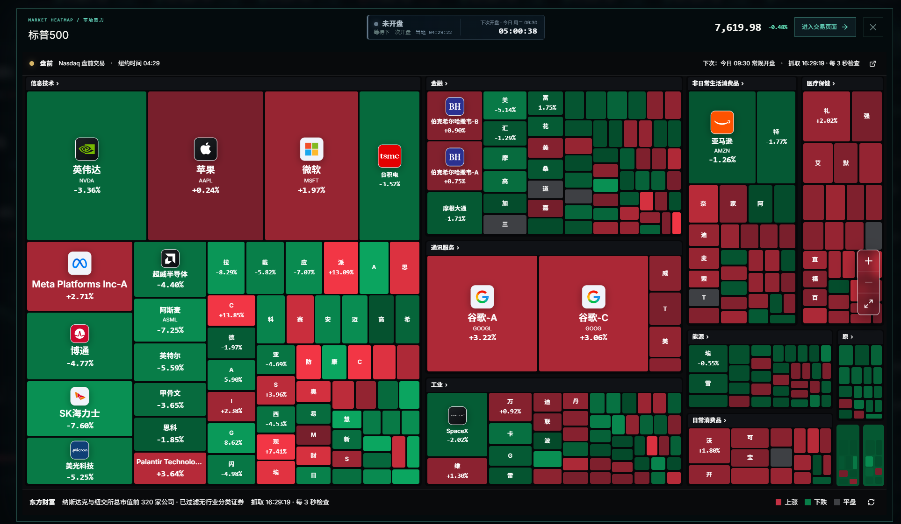
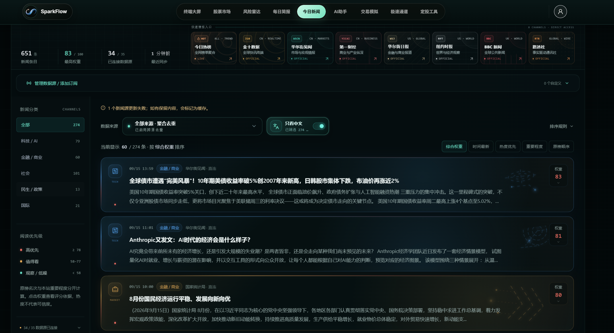
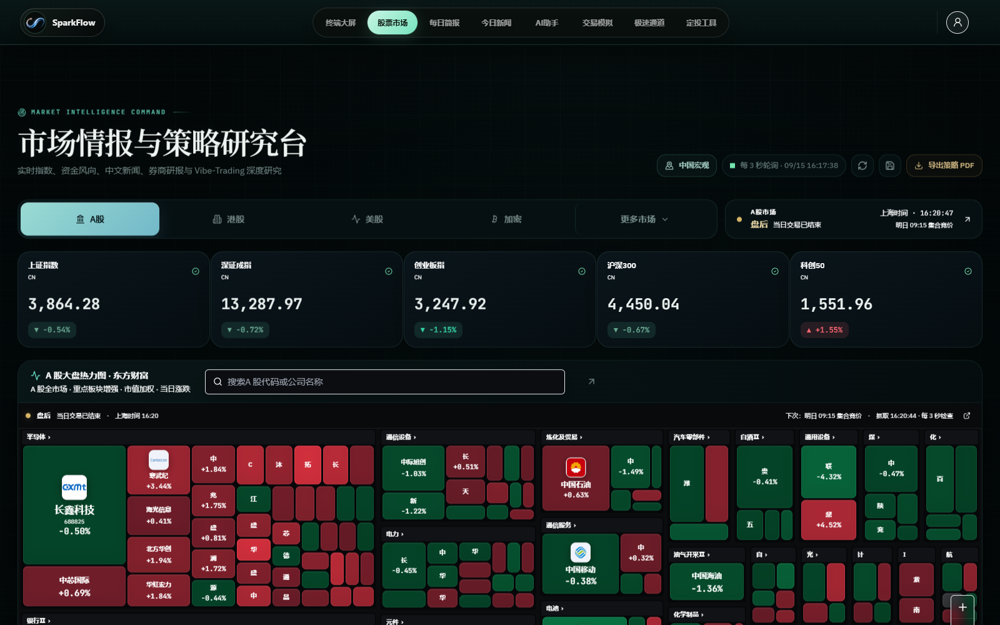
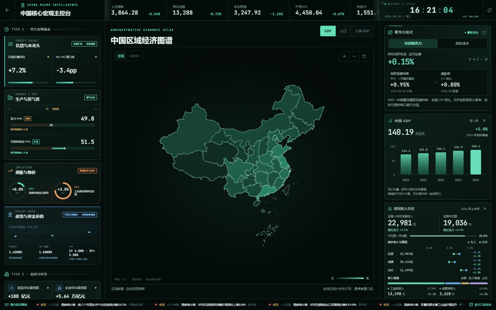
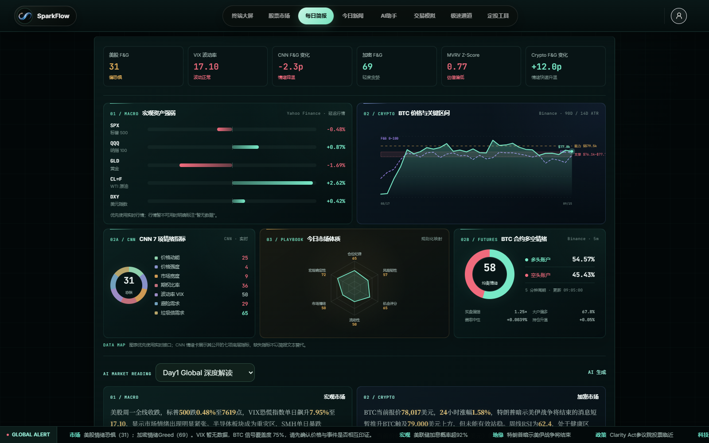
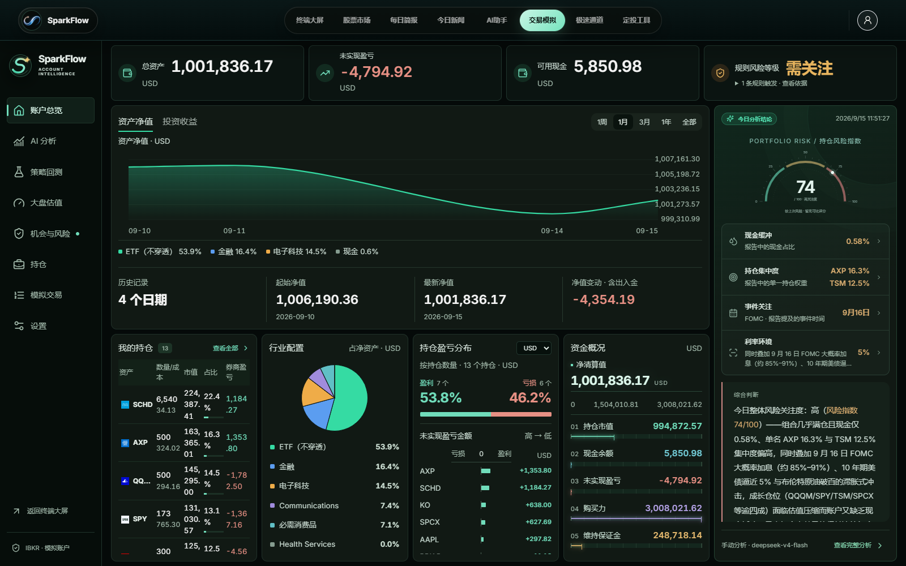
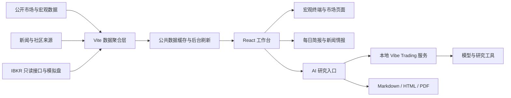

<div align="center">

# ✦ SparkFlow

### 本地优先的全球市场情报、AI 研究与模拟交易工作台

把宏观数据、全球行情、新闻线索、深度研究和账户风险放进同一套安静、清晰、可追溯的工作流。

[](https://react.dev/)
[](https://www.typescriptlang.org/)
[](https://vite.dev/)
[](https://threejs.org/)
[](https://www.python.org/)
[](./LICENSE)

[项目简介](#项目简介) · [实机界面](#实机界面) · [核心能力](#核心能力) · [工程设计](#工程设计) · [快速开始](#快速开始) · [项目文档](#项目文档)

</div>

<p align="center">
  
</p>

<p align="center"><sub>全球宏观经济终端 · 本地运行实例 · 页面行情与时间以截图时点为准</sub></p>

## 项目简介

SparkFlow 面向希望自己掌握数据和研究过程的个人投资者与开发者。它把全球宏观、股票与加密行情、跨平台新闻、AI 深度研究、策略回测以及 IBKR 模拟账户分析组织在一个本地工作台里，减少在行情网站、新闻源、聊天窗口和笔记工具之间反复切换。

这个项目关注的不只是页面展示。公开数据经过统一的聚合、缓存、刷新和降级处理；研究任务保留会话、过程、来源与导出结果；账户数据与模型密钥停留在本机私有目录。每个结论都尽量带上观察时间、数据口径和可回看的证据。

> SparkFlow 用于信息整理、学习和研究。它不提供自动实盘交易，也不构成投资建议。

## 实机界面

下面的图片均来自当前仓库在本地启动后的真实页面，没有使用设计稿或营销样机。交易账户展示的是 IBKR Paper Trading 模拟盘。

<p align="center">
  
</p>

<p align="center"><sub>标普 500 全屏热力图 · 行业分组、公司标识、盘前状态与实时涨跌</sub></p>

<p align="center">
  
</p>

<p align="center"><sub>今日新闻情报工作台 · 多来源聚合、中文筛选、权重排序与订阅管理</sub></p>

<table>
  <tr>
    <td width="50%">
      
      <p align="center"><sub>多市场行情与行业热力图</sub></p>
    </td>
    <td width="50%">
      
      <p align="center"><sub>中国宏观与区域经济图谱</sub></p>
    </td>
  </tr>
  <tr>
    <td width="50%">
      
      <p align="center"><sub>每日市场简报与跨资产信号</sub></p>
    </td>
    <td width="50%">
      
      <p align="center"><sub>IBKR Paper Trading 账户、持仓与风险总览</sub></p>
    </td>
  </tr>
</table>

## 核心能力

| 模块 | 当前能力 |
| --- | --- |
| 全球宏观终端 | 交互式 3D 地球、全球指数、VIX、美元、美债、商品、主要汇率、通胀与就业指标 |
| 中国宏观主控台 | 信贷、PMI、通胀、政策利率、GDP、收入与区域经济图谱，保留来源与更新时间 |
| 多市场热力图 | A 股、港股、美股、加密资产及多个海外股票市场，支持行业分组、搜索、缩放和交易日状态 |
| 每日简报 | 宏观资产、情绪指标、BTC 价格区间、期货多空与 AI 市场解读的统一视图 |
| 新闻情报 | RSS、国际媒体、社区热榜、GitHub、Hacker News、Hugging Face 与 AI 日报聚合，支持排序、去重和自定义订阅 |
| AI 深度研究 | 流式研究过程、工具调用状态、历史会话、报告内追问，以及 Markdown、HTML、PDF 导出 |
| 账户与模拟交易 | IBKR 只读账户快照、持仓分析、收益历史、风险提示、Paper Trading 订单与回执 |
| 策略与长期工具 | 策略回测、指数估值观察、ETF 定投工具、星图情报和本地知识资产入口 |

## 一次完整的研究流程

1. 在全球终端或市场热力图里发现异常信号。
2. 结合每日简报和新闻页核对行情时间、事件来源与市场背景。
3. 把市场、指数、行业或当前模拟持仓交给 AI 助手继续研究。
4. 在研究过程里查看任务状态、调用工具和证据来源。
5. 保存报告并导出 Markdown、HTML 或 PDF，随后在同一会话里继续追问。

账户研究会冻结提交时的账户快照。账户页和 AI 助手使用同一条研究链路，避免两套模型生成互相矛盾的结果。失败、取消、超时和历史恢复都有明确状态，未取得的数据会保留为空缺，不会为了补齐界面而编造数字。

## 工程设计



### 数据可靠性

- 公共数据按资源独立加载。单一来源失败不会拖垮整个页面。
- 高频行情与低频宏观数据使用不同的有效期，后台刷新不会阻塞已有快照。
- 并发访问会复用同一次上游请求，失败后按资源退避，并保留明确的旧数据提示。
- 行情、财务、新闻和宏观数据尽量保留来源、观察日期、抓取时间与口径，跨来源字段不会被静默拼成一条虚构记录。
- 账户信息、AI 配置与个人订阅绕过公共缓存，公共诊断接口也不会暴露本机路径和密钥。

### 研究任务

- React 页面通过本地 API 创建研究会话，并通过事件流持续接收规划、工具执行和报告状态。
- 研究记录区分会话与单次执行。报告内追问复用原会话，同时保留原报告和新的回复。
- 结果不确定的提交请求不会自动重试，避免重复产生任务或模型费用。
- Markdown 使用安全渲染。模型返回的 HTML 和脚本不会直接执行。
- 内置研究服务来自 Vibe Trading，并保留独立许可证与来源说明。

### 本地优先

- 模型密钥写入 Git 已忽略的本地配置文件。
- 研究会话、上传文件、运行记录、账户快照、缓存和日志默认不进入版本控制。
- IBKR 集成以只读研究和 Paper Trading 为主要使用方式，账户研究工具不获得提交真实订单的权限。
- 公开部署前仍应根据使用地区检查行情、新闻与第三方数据源的授权条款。

## 技术栈

| 层级 | 技术 |
| --- | --- |
| 前端 | React 18、TypeScript、React Router、Tailwind CSS、Framer Motion |
| 可视化 | Three.js、OGL、D3 Geo、D3 Hierarchy、Lightweight Charts、GSAP |
| 本地 API | Vite Plugin Server、Node.js、Zod、Undici |
| AI 研究 | Python 3.11、FastAPI、LangChain、LangGraph、Vibe Trading |
| 文档与导出 | React Markdown、jsPDF、html2canvas、ReportLab |
| 质量保障 | TypeScript Build、Node 验证脚本、Pytest、Playwright |

## 快速开始

### 环境要求

- Windows 10 或 Windows 11
- Node.js 20 及以上版本
- Python 3.11 及以上版本，或 [uv](https://docs.astral.sh/uv/)
- Chrome，用于当前 Playwright 浏览器回归测试

### Windows 一键启动

```powershell
git clone https://github.com/XiaoyeCodes/SparkFlow.git
cd SparkFlow
.\start-sparkflow.bat
```

首次启动会安装前端依赖，创建本地 Python 环境，并准备内置研究服务。完成后打开 [http://127.0.0.1:5180](http://127.0.0.1:5180)。

停止服务时运行下面的脚本。

```powershell
.\stop-sparkflow.bat
```

### 手动启动

```powershell
npm ci
npm run dev -- --port 5180 --strictPort
```

`npm run dev` 会在启动前检查研究服务和新闻聚合运行时。生产构建与本地预览可以使用下面的命令。

```powershell
npm run build
npm run preview -- --port 5180 --strictPort
```

## AI 与外部集成

打开右上角头像进入设置，可以配置 OpenAI、智谱、DeepSeek、通义千问或兼容 OpenAI 协议的自定义模型。配置只保存在本机忽略文件中。

IBKR 模拟账户需要本机运行 TWS 或 IB Gateway，并按只读或 Paper Trading 模式完成端口配置。具体步骤见 [IBKR 账户工作台指南](docs/runbooks/ibkr-account-workbench.md) 和 [Paper Trading 连接说明](docs/runbooks/ibkr-paper-connect.md)。

项目还支持 Obsidian 路径、自定义 RSS 或 Atom 订阅，以及可选的 Coze 研究报告通道。可选环境变量模板位于 [.env.example](.env.example)。

## 项目结构

```text
SparkFlow/
├─ src/
│  ├─ components/       终端、图表、热力图与通用界面
│  ├─ routes/           页面路由与研究入口
│  ├─ engine/           前端研究流程与文本处理
│  ├─ lib/              集成、账户、导出与数据客户端
│  └─ data/             内容与静态配置
├─ server/              行情、新闻、缓存、账户与研究 API
├─ services/
│  ├─ dailyhot/         今日热榜本地运行时
│  └─ vibe-trading/     内置 Python 研究服务
├─ scripts/             启动、同步、诊断与验证脚本
├─ tests/               Node、Python 与 Playwright 测试
├─ public/              地球纹理和公开静态资源
└─ docs/                设计记录、运行手册与数据核验文档
```

## 验证与测试

先运行生产构建，确认 TypeScript 和 Vite 打包通过。

```powershell
npm run build
```

按改动范围选择对应回归。

```powershell
npm run test:public-cache
npm run test:page-cache
npm run test:ibkr:unit
npm run test:ibkr:e2e
```

仓库还提供宏观数据、实时行情、每日简报、新闻聚合、区域经济、估值和账户研究等定向验证脚本，完整命令可在 [package.json](package.json) 中查看。浏览器测试使用合成账户和受控接口，不会连接真实账户、发送真实订单或自动生成付费报告。

## 项目文档

- [公共数据缓存设计与运维](docs/public-data-cache.md)
- [新闻来源、排序与容错](docs/news-sources-and-ranking.md)
- [账户研究与 AI 助手共用报告](docs/account-assistant-research.md)
- [账户研究数据来源与真实性边界](docs/account-research-data.md)
- [每日简报部署配置](docs/daily-briefing-setup.md)
- [IBKR 账户工作台运行手册](docs/runbooks/ibkr-account-workbench.md)
- [架构决策记录](docs/adr/)
- [从当前研究引擎走向动态专家团队](docs/guides/sparkflow-agent-engineering-tutorial.md)

## 当前边界

- 免费公开接口可能延迟、限流、调整字段或临时不可用。
- 财务数据会受到 ADR、币种、财年和供应商口径差异影响。
- 新闻排序是可解释的规则估算，不等同于媒体原始判断或事实核验。
- AI 报告可能遗漏引用或产生错误，重要结论仍需回到原始来源复核。
- 当前启动与本地服务管理流程优先支持 Windows，其他平台需要手动调整脚本。
- 项目中部分数据源用到了Yahoo,美国劳工局，coinbase等官方数据，在中国大陆使用时，相关数据需开启VPN后才能正确加载

这些限制会在界面和文档中尽量显式呈现。系统宁可显示数据缺口，也不把缓存、推断或测试数据包装成实时事实。

## 贡献

欢迎通过 Issue 描述问题、数据口径或改进建议。提交代码前请运行与改动相关的验证脚本和生产构建，并确认 `git status` 中没有本地密钥、账户快照、日志或研究记录。

## License

根项目使用 [MIT License](./LICENSE)。`services/vibe-trading` 基于 [HKUDS/Vibe-Trading](https://github.com/HKUDS/Vibe-Trading) 的指定版本集成，相关版权、许可证与修改说明见该目录下的 `LICENSE` 和 `NOTICE`。

---

<div align="center">
  <sub>Built for calm observation, evidence-aware research and long-term thinking.</sub>
</div>
