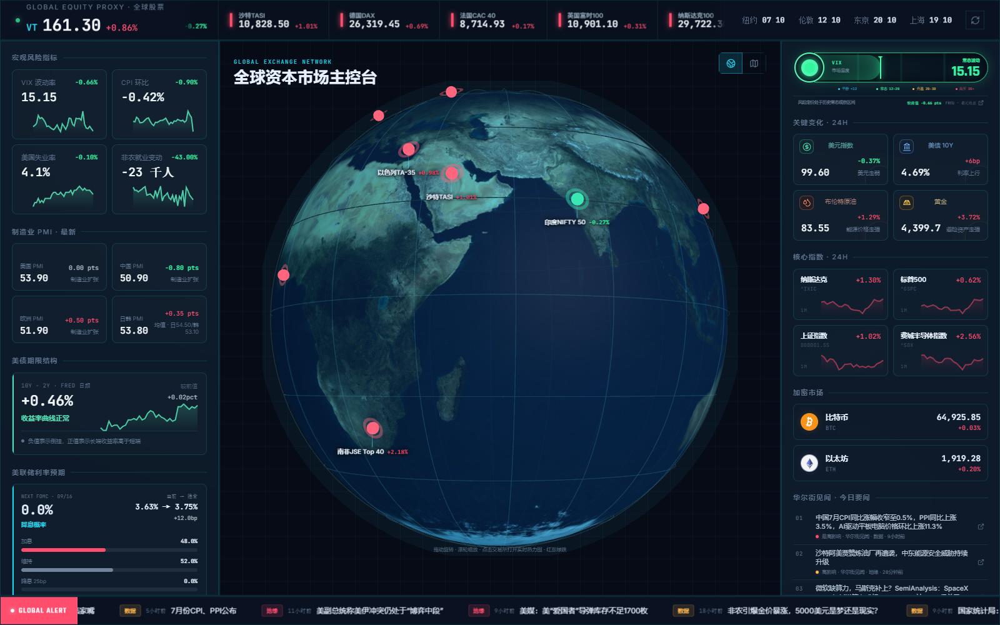
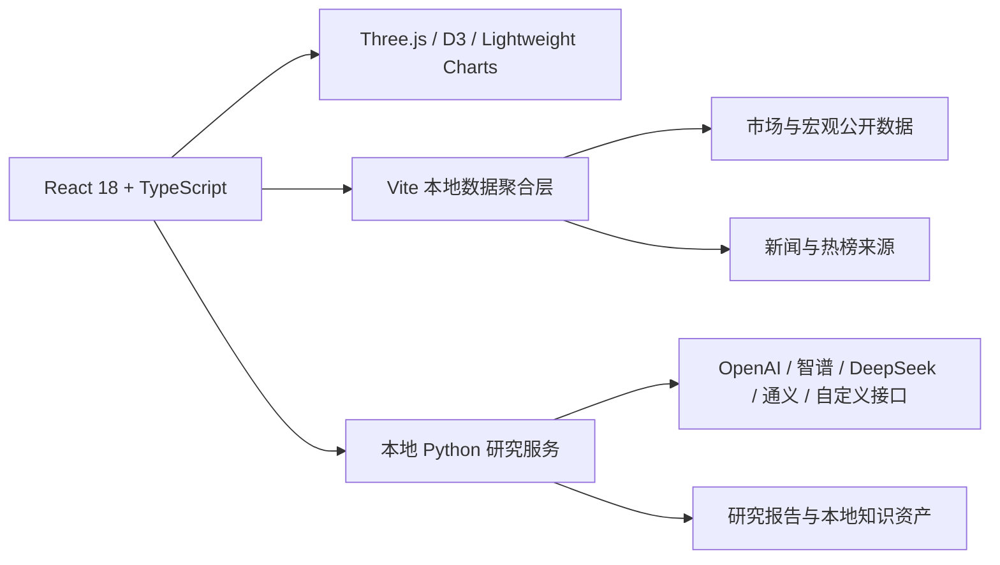

<div align="center">

# ✦ SparkFlow

### 面向个人投资者与研究者的沉浸式市场情报工作台

把全球宏观、市场热力、实时新闻、AI 深度研究与个人知识资产，收束进一个安静但有轨道感的操作系统。

[](https://react.dev/)
[](https://www.typescriptlang.org/)
[](https://vite.dev/)
[](https://threejs.org/)
[](./LICENSE)

</div>

<p align="center">
  
</p>

<p align="center"><sub>全球资本市场主控台 · 实机界面</sub></p>

## SparkFlow 是什么？

SparkFlow 是一个本地优先的个人研究工作台。它不试图替代专业交易终端，而是帮助你在一个屏幕内快速建立对全球市场的整体感知：现在发生了什么、风险在哪里、资金在交易什么，以及哪些信息值得继续深挖。

它把行情、宏观数据、新闻与研究工具组织成具有明确层级的视觉系统，减少在多个网站、终端和笔记工具之间来回切换的成本。

## 核心体验

| 模块 | 能力 |
| --- | --- |
| 🌍 全球宏观主控台 | 交互式 3D 地球、全球主要指数、宏观风险、PMI、美债期限结构与联储利率预期 |
| 🌡️ 风险温度 | VIX 波动率温度计、美元、美债、原油、黄金与关键风险资产的 24H 变化 |
| 🗺️ 多市场热力 | A 股、港股、美股与加密市场热力图，支持行业、涨跌和市值维度观察 |
| 📰 新闻情报 | 华尔街见闻重点内容与独立的全球头条滚动带，按时效、重要性和事件相似度筛选 |
| 🤖 AI 深度研究 | 面向市场、指数和行业的本地研究流程，可接入多家模型或自定义兼容接口 |
| 🪐 个人知识空间 | 星图情报、长期主题、阅读书单、项目作品与个人随笔的统一入口 |

## 全球宏观主控台

- **一眼理解全球风险方向**：全球股票代理、VIX、通胀、就业、制造业 PMI、美债曲线与联储预期集中展示。
- **连续丝滑的 3D 地球**：市场数据热更新不会重建场景，地球自转、缩放与标签跟随保持连续。
- **核心指数脉搏**：纳斯达克、标普 500、上证指数和费城半导体指数展示近一个月走势。
- **事件级新闻去重**：相同事件即使来自不同平台或标题写法不同，也会合并后再进入滚动带。
- **新鲜度优先**：底部头条以当日内容为主，并结合来源、影响范围和发布时间进行分层筛选。

## 技术架构



### 前端

- React 18、TypeScript、Vite
- Three.js、D3 Geo、D3 Hierarchy
- Lightweight Charts、Framer Motion
- Tailwind CSS、Lucide Icons

### 本地研究引擎

- Python 3.11+
- 本地会话、运行记录与上传目录
- 支持流式研究过程和工具执行状态展示
- AI 密钥仅保存在本机忽略文件中

## 快速开始

### 推荐方式：Windows 一键启动

准备以下环境：

- [Node.js 20+](https://nodejs.org/)
- Python 3.11+ 或 [uv](https://docs.astral.sh/uv/)

克隆仓库后，双击：

```text
start-sparkflow.bat
```

脚本会自动安装前端依赖、准备本地研究环境、选择可用端口并启动服务。首次运行需要下载依赖，可能耗时数分钟；以后会根据锁文件与依赖哈希跳过重复安装。

停止服务：

```text
stop-sparkflow.bat
```

### 仅启动前端

```bash
npm ci
npm run dev
```

构建生产版本：

```bash
npm run build
npm run preview
```

## AI 设置

打开页面右上角头像，进入“设置”，选择 OpenAI、智谱、DeepSeek、通义千问或自定义兼容接口，然后填写 API Key 与模型名称。

密钥仅写入本机忽略文件，不会进入 Git。提交代码前仍建议使用 `git status` 再次确认没有配置文件或运行数据被暂存。

## 项目结构

```text
SparkFlow/
├─ src/
│  ├─ components/       # 市场、地球、热力图与通用视觉组件
│  ├─ routes/           # 市场、助手、星图、书单、作品等页面
│  ├─ engine/           # 前端研究流程与文本处理
│  ├─ lib/              # 集成设置与市场交易时段逻辑
│  └─ data/             # 内容与静态配置
├─ services/
│  └─ vibe-trading/     # 本地 AI 深度研究服务
├─ scripts/             # 环境准备与资源同步脚本
├─ public/              # 地球纹理与公开静态资源
├─ docs/                # 设计文档、ADR 与界面图片
└─ vite.config.ts       # 本地数据聚合接口与开发服务器配置
```

## 数据说明

SparkFlow 聚合多个公开市场、宏观与新闻来源。不同数据可能具有实时、延迟、历史快照或单一来源状态，界面会尽可能显示更新时间、验证状态和来源链接。

新闻排序并不等同于任何单一媒体的原始排序；它会综合发布时间、事件影响、来源可信度、主题覆盖与相似事件去重。第三方接口或网页结构变化可能导致部分模块暂时不可用。

## 隐私与本地数据

以下内容默认保存在本地并已加入 `.gitignore`：

- AI 接口密钥与本地配置
- 研究会话、运行记录和上传文件
- Python 虚拟环境
- 构建产物、缓存和日志

## 免责声明

本项目用于信息整理、学习与研究，不构成投资建议、交易邀请或收益承诺。行情与新闻可能延迟、缺失或存在误差；任何投资决策都应基于独立判断并自行承担风险。

## License

根项目采用 [MIT License](./LICENSE)。内置研究服务如包含独立许可证、NOTICE 或第三方条款，以其目录中的对应文件为准。

---

<div align="center">
  <sub>Built for calm observation, deep research and long-term thinking.</sub>
</div>
